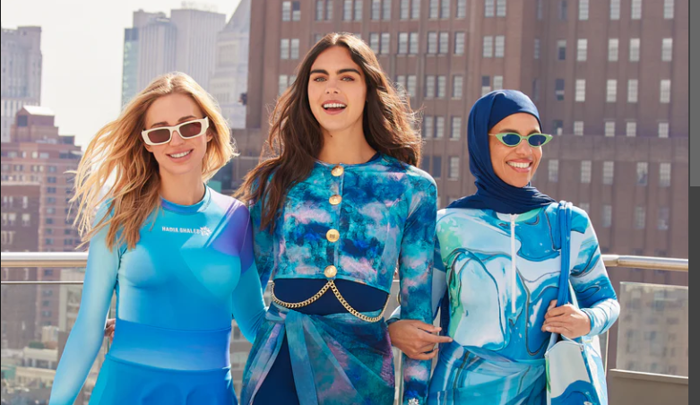
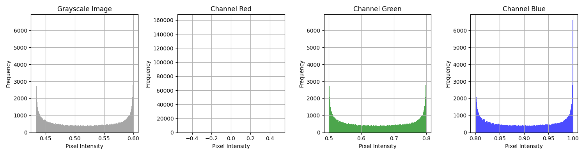

# Hadia Ghaleb Swimear Pattern Generation and Analysis

## Project Overview
This Python project generates a tropical wave-like pattern inspired from the swimwear patterns designed by HAdia Ghaleb using sinusoidal functions combined with Perlin noise. The patterns are then visualized in a tropical color palette and analyzed through histograms of pixel intensities across grayscale and RGB channels.

## Features
- **Pattern Generation:** Sinusoidal functions and Perlin noise to create unique wave-like patterns.
- **Color Mapping:** Utilizes a tropical color palette ranging from dark blue to cyan.
- **Image Analysis:** Calculates and displays the mean and standard deviation of the grayscale image.
- **Histograms:** Plots histograms for grayscale and each RGB channel to analyze the pixel intensity distribution.

## Technologies Used
- Python 3
- NumPy
- Matplotlib
- SciPy

## How to Run
Ensure you have Python installed along with the required libraries: NumPy, Matplotlib, and SciPy. You can install them using pip:

```bash
pip install numpy matplotlib scipy
```

Run the script using:
```bash
python tropical_wave_pattern.py
```

## Results
Upon running the script, two sets of visualizations will be displayed:
1. The generated color image showing the tropical wave pattern.
2. A set of four histograms representing the pixel intensity distributions of the grayscale image and each RGB channel.

## Code Description
- **Pattern Generation:** Sinusoidal wave patterns are generated and combined with Gaussian filtered noise to simulate Perlin noise.
- **Color Interpolation:** Linear interpolation is used to map generated patterns to a specified color range.
- **Histogram Analysis:** Histograms for the grayscale and RGB channels are created to visualize the pixel intensity distribution.

## Project Files
- `tropical_wave_pattern.py` - The main Python script that generates the patterns and performs the analysis.

## Authors
- Mohamed Hamed 

## License
This project is licensed under the MIT License - see the [LICENSE.md](LICENSE) file for details.

## Acknowledgments
- Inspiration from mathematical patterns in nature and digital art and Hadya Ghaleb's Swimwear :D

## Inspration vs Results





